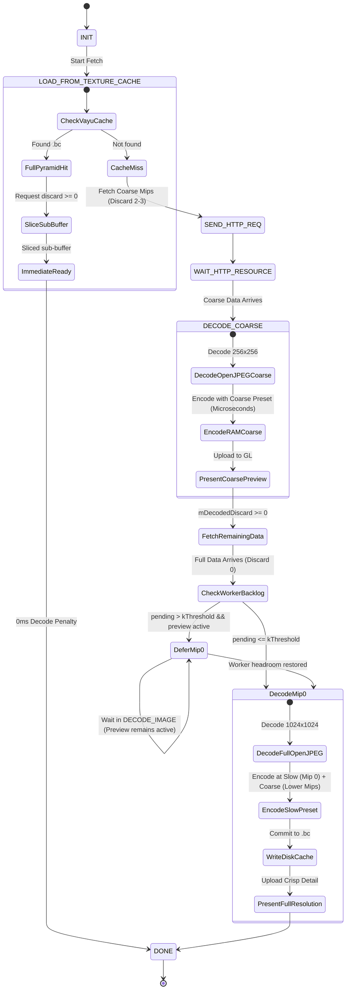

# Phase 1 Data Model: Progressive Mip Residency

**Feature**: Progressive Mip Residency (Resolution Staging) for Texture Streaming and Block Compression
**Spec**: [spec.md](spec.md)
**Status**: Completed

## 1. Entities & Data Structures

### Entity 1: `VayuBCCacheEntryHeader`
Represents the metadata stored in persistent block-compressed texture cache files (`<uuid>.bc`) and memory descriptors.

| Field | Type | Description | Invariant / Validation Rule |
| :--- | :--- | :--- | :--- |
| `mMagic` | `U32` | 4-byte magic identifier (`kMagic` = `0x31434256`, 'VBC1') | Must equal `kMagic` |
| `mVersion` | `U32` | Binary format version | Must equal `kFormatVersion` (2) |
| `mFormat` | `U8` | `EVayuBlockCompressionFormat` enum (BC1, BC3, BC4, BC5, BC7) | Must be valid format value |
| `mPreset` | `U8` | `EVayuBlockCompressionPreset` enum | Standardized to `Slow` (`3`) for full-resolution pyramids |
| `mIsMask` | `U8` | 1-bit cutout alpha mask indicator | `0` (blend/opaque) or `1` (cutout) |
| `mDiscardLevel` | `U8` | Discard level of entry (0 = full resolution) | Stores highest resolved discard (upgradable when finer discard arrives) |
| `mMipLevels` | `S32` | Number of mip levels in compressed buffer | $> 0$ |
| `mWidth` | `U32` | Width of top mip level in pixels | Dimension of highest stored mip |
| `mHeight` | `U32` | Height of top mip level in pixels | Dimension of highest stored mip |
| `mComponents` | `S32` | Channel count of source asset | $1 \le mComponents \le 4$ |
| `mGLInternalFormat` | `U32` | Compressed GL internal format | Matches `mFormat` |
| `mGLPrimaryFormat` | `U32` | Compressed GL primary format | Matches `mFormat` |

---

### Entity 2: `VayuBlockCompressionResult`
Transient in-memory structure attached to `LLImageRaw` representing compressed block data and mip chains.

| Field | Type | Description |
| :--- | :--- | :--- |
| `mFormat` | `EVayuBlockCompressionFormat` | Compressed texture format |
| `mPreset` | `EVayuBlockCompressionPreset` | Encoding preset used (Hybrid by default: Mip 0 `Slow`, sub-mips `Fast`; pure `Slow` optional via debug setting) |
| `mWidth`, `mHeight` | `U32` | Image dimensions |
| `mMipLevels` | `S32` | Total mip level count |
| `mComponents` | `S32` | Source channels |
| `mIsMask` | `bool` | Alpha mask evaluation result |
| `mBuffer` | `std::vector<U8>` | Packed compressed blocks stored in reverse order (smallest mip at byte offset 0, largest mip at end) |

---

### Entity 3: `LLTextureFetchWorker` Streaming State
Manages progressive streaming lifecycle across cache checks, HTTP downloads, and decode thread queuing.

| Field | Type | Description | Invariant / Validation Rule |
| :--- | :--- | :--- | :--- |
| `mState` | `e_state` | State machine state (`INIT`, `LOAD_FROM_TEXTURE_CACHE`, `DECODE_IMAGE`, etc.) | Valid state enum |
| `mDesiredDiscard` | `S32` | Target discard requested by scene renderer | $0 \le mDesiredDiscard \le \text{MAX\_DISCARD\_LEVEL}$ |
| `mLoadedDiscard` | `S32` | Discard level of currently available raw/formatted data | $\ge 0$ |
| `mDecodedDiscard` | `S32` | Discard level of currently active rendered texture preview | $-1$ if undecoded, $\ge 0$ once decoded |
| `mHaveAllData` | `bool` | True when complete asset stream received | `true` triggers Mip 0 resolution |

---

## 2. State Machine & Lifecycle Transitions

---

## 3. Invariants & Validation Rules

1. **Resolution Overwrite Invariant**:
   $$\text{incoming.mDiscardLevel} < \text{existing.mDiscardLevel}$$
   A disk write upgrades the on-disk cache if $\text{incoming.mDiscardLevel} < \text{existing.mDiscardLevel}$. If $\text{existing.mDiscardLevel} \le \text{incoming.mDiscardLevel}$, the write is rejected to prevent coarser data from overwriting finer data.

2. **Upgradable Cache Persistence Invariant**:
   Both coarse decodes and full pyramids write to persistent disk storage (`<uuid>.bc`) as upgradable entries. Coarser entries are upgraded in-place when higher-resolution decodes arrive, ensuring no J2C decode work is wasted across sessions.

3. **Target Quality Invariant**:
   Textures default to hybrid encoding (Mip 0 `Slow`, lower mips `Fast`) for optimal streaming responsiveness. An optional developer debug setting (`RenderCompressTexturesHybridMips`) enables pure `Slow` encoding across all mips for benchmarking. User-facing preferences UI is eliminated.

4. **Preset Independence Invariant**:
   `readEntry()` contains no minimum preset filter. All valid files matching the UUID and satisfying the requested resolution are admitted as immediate cache hits.
