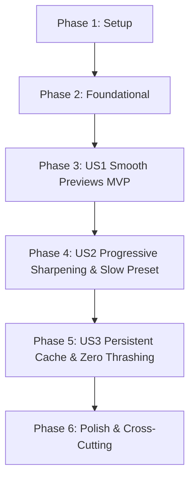

# Implementation Tasks: Progressive Mip Residency (Resolution Staging)

**Feature**: Progressive Mip Residency (Resolution Staging) for Texture Streaming and Block Compression  
**Branch**: `001-progressive-mip-residency` | **Date**: 2026-09-16  
**Spec**: [spec.md](spec.md) | **Plan**: [plan.md](plan.md)

---

## Phase 1: Setup (Shared Infrastructure)

**Purpose**: Baseline verification and test harness setup across affected components.

- [x] T001 Audit existing working tree diffs in indra/llimage/ and indra/newview/ against resolution staging requirements
- [x] T002 [P] Prepare unit test harness in indra/llimage/tests/vayuimageblockcompressor_test.cpp and indra/llimage/tests/vayubctexturecache_test.cpp for updated signatures

---

## Phase 2: Foundational (Blocking Prerequisites)

**Purpose**: Core cache architecture, sub-buffer slicing, and signature updates that all user stories depend on.

**⚠️ CRITICAL**: No user story work can begin until this phase is complete.

- [x] T003 Implement sub-buffer slicing helper `VayuBCTextureCache::calcSubBufferBytes(U8 format, U32 width, U32 height, S32 num_mips, S32 diff)` in indra/llimage/vayubctexturecache.cpp and indra/llimage/vayubctexturecache.h
- [x] T004 Update `VayuBCTextureCache::readEntry` in indra/llimage/vayubctexturecache.h and indra/llimage/vayubctexturecache.cpp to remove `min_preset` parameter, slice sub-buffers for coarser discards (`diff = discard_level - entry.mDiscardLevel`), and update access times
- [x] T005 Update `VayuBCTextureCache::writeEntry` in indra/llimage/vayubctexturecache.cpp to write to `<uuid>.bc` and enforce overwrite invariant: reject write if existing entry satisfies `existing.mDiscardLevel <= local_header.mDiscardLevel`
- [x] T006 [P] Update `readEntry` call sites in indra/llimage/llimageworker.cpp and indra/newview/lltexturefetch.cpp to match signature without `min_preset`

**Checkpoint**: Foundation ready - cache operates without preset gating and supports sub-buffer slicing. User story implementation can now begin.

---

## Phase 3: User Story 1 - Instant Smooth Previews During Movement (Priority: P1) 🎯 MVP

**Goal**: Coarse mips ($\le 256 \times 256$, Discard $> 0$) decode and encode in RAM in microseconds and display immediately without thread hitching or disk cache pollution.

**Independent Test**: Teleport into a texture-dense region; verify that coarse texture previews display on surrounding geometry within milliseconds without causing render thread hitches.

- [x] T007 [US1] Update `ImageRequest::processRequest()` in indra/llimage/llimageworker.cpp to attach coarse compressed blocks to `mDecodedImageRaw` in RAM and write entries to `VayuBCTextureCache` with discard upgrade invariant enforcement
- [x] T008 [US1] Update `LLTextureFetchWorker::doWork` in indra/newview/lltexturefetch.cpp to handle coarse decode completion (`mLoadedDiscard > 0`), recording `mDecodedDiscard` and transitioning smoothly to render coarse previews
- [x] T009 [US1] Update indra/llimage/tests/llimageworker_test.cpp to verify coarse decode attaches compressed blocks in RAM and passes valid discard levels to cache writes

**Checkpoint**: User Story 1 functional and independently testable. Coarse previews display instantly and write upgradable entries to cache.

---

## Phase 4: User Story 2 - Progressive Sharpening with Fixed Maximum Asset Fidelity (Priority: P2)

**Goal**: Standardize Mip 0 encoding to `Slow`, encode lower mips with coarser presets, defer Discard 0 when worker queue is saturated, and eliminate user-settable preset controls.

**Independent Test**: Stand still after arriving in a region; verify textures smoothly sharpen to full `Slow` fidelity once worker queues drop below threshold, with zero Mode-6 block artifacts or dynamic downgrades.

- [x] T010 [US2] Update `VayuImageBlockCompressor` in indra/llimage/vayuimageblockcompressor.h and indra/llimage/vayuimageblockcompressor.cpp to standardize hybrid encoding (Mip 0 `Slow`, sub-mips `Fast`) by default, add `setHybridMips`/`getHybridMips` debug toggle for pure `Slow` mode, and eliminate `setQueueBacklog`, `getEffectivePreset`, `kModerateBacklogThreshold`, and `kHeavyBacklogThreshold`
- [x] T011 [US2] Update `LLTextureFetchWorker::doWork` in indra/newview/lltexturefetch.cpp to defer Discard 0 decode when a preview is already active (`discard == 0 && mDecodedDiscard >= 0`) and worker backlog exceeds threshold (`LLAppViewer::getImageDecodeThread()->getPending() > 16`)
- [x] T012 [P] [US2] Remove `RenderCompressTexturesPreset` setting definition from indra/newview/app_settings/settings.xml and add `RenderCompressTexturesHybridMips` debug setting (default true)
- [x] T013 [P] [US2] Update startup initialization in indra/newview/llappviewer.cpp and signal listener in indra/newview/llviewercontrol.cpp for `RenderCompressTexturesHybridMips`
- [x] T014 [P] [US2] Remove `CompressionPreset` combo box and label from indra/newview/skins/default/xui/en/floater_preferences_graphics_advanced.xml
- [x] T015 [US2] Update unit tests in indra/llimage/tests/vayuimageblockcompressor_test.cpp to verify hybrid mode by default, `setHybridMips` toggle, and absence of dynamic backlog downgrades

**Checkpoint**: User Stories 1 and 2 work in harmony. Textures sharpen to pristine `Slow` fidelity without queue starvation or UI preset complexity.

---

## Phase 5: User Story 3 - Persistent Cache Reliability and Zero Thrashing (Priority: P3)

**Goal**: Ensure 100% cache hit reliability, zero duplicate decodes, and verified sub-buffer slicing from on-disk `<uuid>.bc` files.

**Independent Test**: Revisit a previously loaded location after restarting the viewer; verify that cached textures load directly from disk storage at maximum stored resolution with 0ms decode penalty and without triggering re-decode ladders.

- [x] T016 [US3] Verify and refine early cache check in `LLTextureFetchWorker::doWork` under `LOAD_FROM_TEXTURE_CACHE` in indra/newview/lltexturefetch.cpp to immediately fulfill requests from `VayuBCTextureCache` without queuing or network fetches
- [x] T017 [US3] Update unit tests in indra/llimage/tests/vayubctexturecache_test.cpp to validate sub-buffer slicing (`calcSubBufferBytes`), zero preset gating, and overwrite protection

**Checkpoint**: All user stories functional. Texture cache hits immediately with zero thrashing.

---

## Phase 6: Polish & Cross-Cutting Concerns

**Purpose**: Cleanup, validation, and verification across the repository.

- [x] T018 [P] Audit declaration references across indra/ for any legacy forward declarations of removed preset or backlog functions
- [x] T019 [P] Update documentation in specs/001-progressive-mip-residency/quickstart.md with finalized test commands and validation steps
- [x] T020 Review git diff across all modified files to ensure strict plan adherence and zero unintended modifications

---

## Phase 7: Upgrade Cache Invalidation

**Purpose**: Invalidate and purge legacy on-disk caches on upgrade when `VayuBCTextureCacheVersion != kFormatVersion` (where `kFormatVersion == 3`).

- [x] T021 Expose `kFormatVersion = 3` in `indra/llimage/vayubctexturecache.h` and align file header validation in `indra/llimage/vayubctexturecache.cpp`
- [x] T022 Add `VayuBCTextureCacheVersion` setting in `indra/newview/app_settings/settings.xml` and startup cache invalidation check in `LLAppViewer::initCache()` in `indra/newview/llappviewer.cpp`
- [x] T023 Update `indra/llimage/tests/vayubctexturecache_test.cpp` to use `VayuBCTextureCache::kFormatVersion` (3) in test headers and verify stale version rejection

---

## Dependencies & Execution Order

### Phase Dependencies

- **Setup (Phase 1)**: No dependencies - can start immediately
- **Foundational (Phase 2)**: Depends on Setup completion - BLOCKS all user stories
- **User Stories (Phase 3+)**:
  - **User Story 1 (P1)**: Depends on Phase 2. Delivers MVP (instant RAM previews).
  - **User Story 2 (P2)**: Depends on Phase 2 and US1 preview lifecycle. Delivers progressive sharpening to `Slow` and removes UI preset knob.
  - **User Story 3 (P3)**: Depends on Phase 2 and US2 full pyramid persistence. Delivers instant cache hits.
- **Polish (Phase 6)**: Depends on all user stories completing.

---

## Parallel Opportunities

- **Phase 1**: `T002` [P] can run concurrently with `T001`.
- **Phase 2**: `T006` [P] can update call sites concurrently after `T004` signature is drafted.
- **Phase 4**: `T012`, `T013`, and `T014` [P] (UI/settings cleanup) can run in parallel across separate files while core compressor updates in `T010` are underway.
- **Phase 6**: `T018` and `T019` [P] can run concurrently before final diff review `T020`.

---

## Implementation Strategy

### MVP First (User Story 1 Only)
1. Complete Phase 1: Setup (`T001`, `T002`).
2. Complete Phase 2: Foundational (`T003` - `T006`).
3. Complete Phase 3: User Story 1 (`T007` - `T009`).
4. **STOP and VALIDATE**: Verify that coarse previews display immediately in RAM with zero hitches and no incomplete files written to disk.

### Incremental Delivery
1. Foundation + US1 → Coarse previews in RAM (MVP).
2. Add US2 → Deferred Mip 0 resolution at fixed `Slow` preset; remove obsolete preset knob (`T010` - `T015`).
3. Add US3 → Early cache lookup & sub-buffer slicing (`T016` - `T017`).
4. Polish & Review → Clean repository state (`T018` - `T020`).
