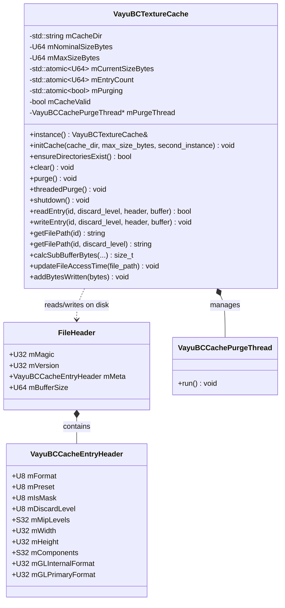
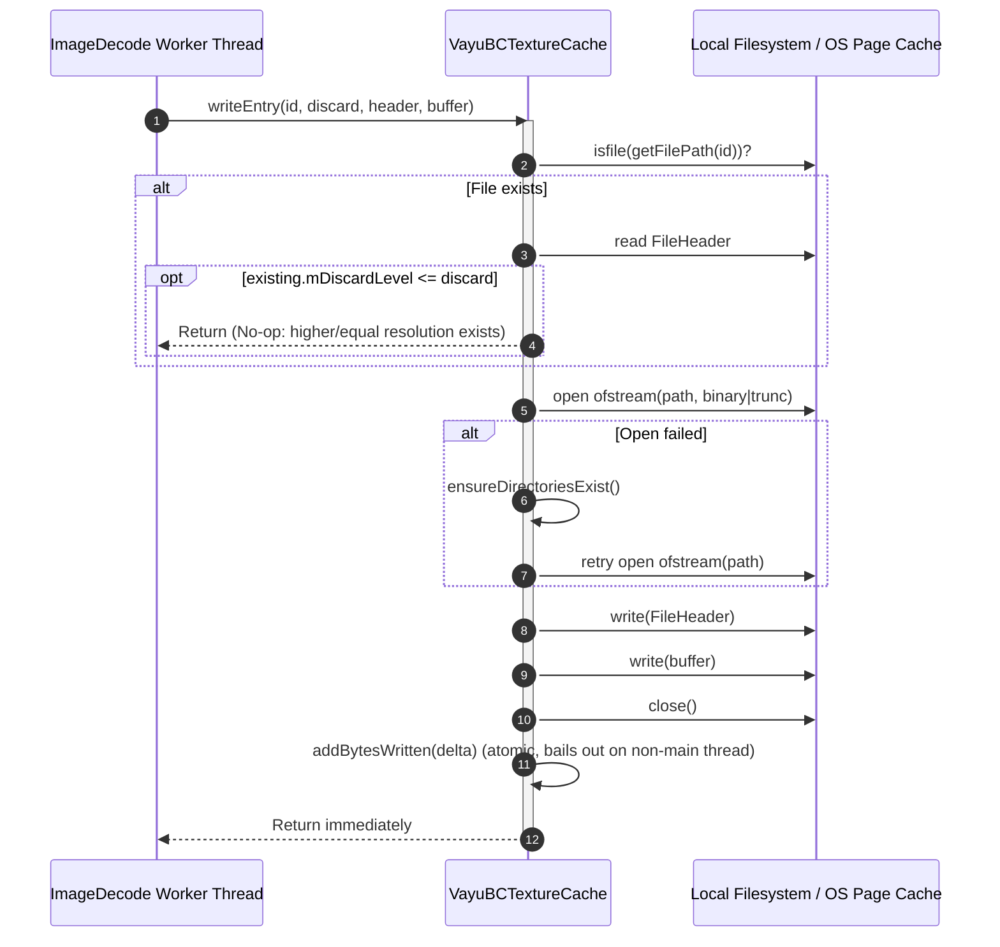
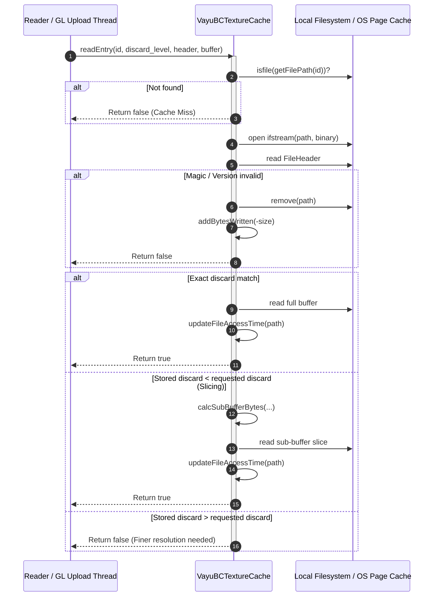

# Phase 1 Data Model: Direct Worker Storage Writes for Block-Compressed Texture Cache

## Entities & Memory Representation



---

### 1. `VayuBCTextureCache` (Process Singleton)

Responsible for coordinating on-disk cache directories, lock-free size tracking, direct worker reads and writes, and main-thread maintenance purging.

| Field | Type | Access / Concurrency | Description |
| :--- | :--- | :--- | :--- |
| `mCacheDir` | `std::string` | Read-only after `initCache` | Base path for the BC cache (`~/.vayu/cache/bccache/`) |
| `mNominalSizeBytes` | `U64` | Read-only after `initCache` | Target capacity after purging (e.g. user budget) |
| `mMaxSizeBytes` | `U64` | Read-only after `initCache` | Threshold triggering auto-purge (150% of nominal) |
| `mCurrentSizeBytes` | `std::atomic<U64>` | Lock-free atomic | Real-time byte tally of cached entries on disk |
| `mEntryCount` | `std::atomic<U64>` | Lock-free atomic | Real-time count of cached files on disk |
| `mPurging` | `std::atomic<bool>` | Lock-free atomic | Flag indicating an active purge thread |
| `mCacheValid` | `bool` | Set on init/shutdown | Validity flag for cache operations |
| `mPurgeThread` | `VayuBCCachePurgeThread*` | Main thread only | Pointer to active purge thread |

> [!IMPORTANT]
> **Eliminated Fields**: `mWriterPool`, `mPendingWrites`, `mPendingIndex`, `mFlushing`, `mPendingBytes`, `mMaxPendingBytes`, `mDroppedWrites`, `mDroppedBytes`, `mDroppedWritesReported`, `mLastDropLogTime`, `mDraining`, and `PendingWrite`.

---

### 2. `VayuBCCacheEntryHeader` (Metadata)

C-compatible metadata header describing texture encoding, dimensions, and GL upload formats.

| Field | Type | Size | Description |
| :--- | :--- | :--- | :--- |
| `mFormat` | `U8` | 1 byte | Compression format (`1` = BC1, `2` = BC3, `3` = BC7) |
| `mPreset` | `U8` | 1 byte | Compression preset (`0` = Fast, `1` = Medium, `2` = Slow) |
| `mIsMask` | `U8` | 1 byte | `1` if alpha mask, `0` if alpha blend / opaque |
| `mDiscardLevel` | `U8` | 1 byte | Discard level of root mip (`0` = full resolution) |
| `mMipLevels` | `S32` | 4 bytes | Total mip levels present in the stored payload |
| `mWidth` | `U32` | 4 bytes | Width of the largest mip in pixels |
| `mHeight` | `U32` | 4 bytes | Height of the largest mip in pixels |
| `mComponents` | `S32` | 4 bytes | Color components (3 = RGB, 4 = RGBA) |
| `mGLInternalFormat` | `U32` | 4 bytes | OpenGL compressed internal format enum |
| `mGLPrimaryFormat` | `U32` | 4 bytes | OpenGL base primary format enum |

Total size: 28 bytes.

---

### 3. On-Disk Binary Format: `FileHeader`

Stored as the leading binary payload of every `<uuid>.bc` file on disk.

```text
+-----------------------+-----------------------+---------------------------------------+-----------------------+
|  mMagic (4 bytes)     |  mVersion (4 bytes)   |  mMeta (28 bytes)                     |  mBufferSize (8 bytes)|
|  0x31434256 ("VBC1")  |  0x00000003 (kVer=3)  |  (VayuBCCacheEntryHeader)             |  Payload byte length  |
+-----------------------+-----------------------+---------------------------------------+-----------------------+
|  Compressed Texture Byte Stream (mBufferSize bytes) ...                                                       |
+---------------------------------------------------------------------------------------------------------------+
```

---

## State Machine & Execution Lifecycles

### Direct Worker Write Flow (Lock-Free, No Purge Spawning)



### Direct Read Flow



---

## Core Invariants

1. **Zero Mutex Across File I/O**: `writeEntry()`, `readEntry()`, and `purge()` never hold `mMutex` during file opens, reads, writes, stats, or closes.
2. **Strict Worker Decoupling from Purge**: Worker writes NEVER check cache limits or launch purge threads. In `addBytesWritten()`, non-main threads bail out immediately (`if (!is_main_thread()) return;`).
3. **Resolution Staging Invariant**: An on-disk entry with lower discard level (higher resolution) is never overwritten by a write with a higher discard level (coarser resolution).
4. **Partitioned Isolation**: Textures are partitioned into `cache_dir / hex_subdir / <uuid>.bc` where `hex_subdir` is `id.asString()[0]`. Two concurrent writes for different UUIDs never touch the same file.
5. **Lock-Free Size Accounting**: `mCurrentSizeBytes` accurately reflects on-disk volume through atomic fetch-add and compare-exchange operations.
